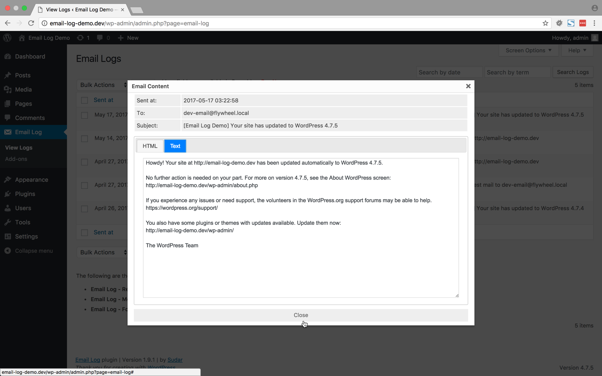

# Email Log #
**Contributors:** sudar  
**Tags:** email, log, log email, resend email, multisite  
**Requires PHP:** 5.3  
**Requires at least:** 4.0  
**Tested up to:** 4.9  
**Stable tag:** 2.2.5  
        

Log and view all outgoing emails from WordPress. Works with WordPress Multisite as well.

## Description ##

Email Log is a WordPress plugin that allows you to easily log and view all emails sent from WordPress.
This would be very useful for debugging email related problems in your WordPress site or for storing sent emails for auditing purposes.

You can perform advanced actions like re-sending email, automatically forwarding emails or export logs with our [premium add-ons](https://wpemaillog.com/store/?utm_campaign=Upsell&utm_medium=wporg&utm_source=readme&utm_content=store).

### Viewing logged emails

The logged emails will be stored in a separate table and can be viewed from the admin interface.
While viewing the logs, the emails can be filtered or sorted based on the date, email, subject etc.

### Deleting logged emails

In the admin interface, all the logged emails can be delete in bulk or can also be selectively deleted based on date, email and subject.
If you want to automatically delete the email logs after some days, then you can use the [Auto Delete Logs](https://wpemaillog.com/addons/auto-delete-logs/?utm_campaign=Upsell&utm_medium=wporg&utm_source=readme&utm_content=dl) add-on.

### Resend email (Pro addon)

You can [buy the Resend email pro add-on](https://wpemaillog.com/addons/resend-email/?utm_campaign=Upsell&utm_medium=wporg&utm_source=readme&utm_content=re),
which allows you to resend the email directly from the email log.
The add-on allows you to modify the different fields of the email before resending it.

### More Fields (Pro addon)

You can [buy the More Fields pro add-on](https://wpemaillog.com/addons/more-fields/?utm_campaign=Upsell&utm_medium=wporg&utm_source=readme&utm_content=mf),
which shows additional fields in the email log page. The following are the additional fields that are added by this addon.

- From
- CC
- BCC
- Reply To
- Attachment

### Forward email (Pro addon)

You can [buy the Forward email pro add-on](https://wpemaillog.com/addons/more-fields/?utm_campaign=Upsell&utm_medium=wporg&utm_source=readme&utm_content=fe),
which allows you to send a copy of all the emails send from WordPress to another email address.
The addon allows you to choose whether you want to forward through to, cc or bcc fields.
This can be extremely useful when you want to debug by analyzing the emails that are sent from WordPress.

### Export email logs (Pro addon)

You can buy the [Export Email Logs add-on](https://wpemaillog.com/addons/export-logs/?utm_campaign=Upsell&utm_medium=wporg&utm_source=readme&utm_content=el), which allows you to export the email logs as a csv file for further processing or record keeping.

### Cleaning up db on uninstall

As [recommended by Ozh][1], the Plugin has an uninstall hook which will clean up the database and options when the Plugin is uninstalled.

 [1]: http://sudarmuthu.com/blog/2009/10/07/lessons-from-wordpress-plugin-competition.html

### Documentation

You can find fully searchable documentation about using the plugin in the [doc section of the Email Log](https://wpemaillog.com/docs/) website.

### Development

The development of the Plugin happens over at [github](http://github.com/sudar/email-log).
If you want to contribute to the Plugin, [fork the project at github](http://github.com/sudar/email-log) and send me a pull request.

If you are not familiar with either git or Github then refer to this [guide to see how fork and send pull request](http://sudarmuthu.com/blog/contributing-to-project-hosted-in-github).

### Support

- If you have a question about usage of the free plugin or need help to troubleshoot, then post in [WordPress forums](https://wordpress.org/support/plugin/email-log).
- If you have a question about any of the pro add-ons or have a feature request then post them in the [support section of our site](https://wpemaillog.com/support/?utm_campaign=Upsell&utm_medium=wporg&utm_source=readme&utm_content=support).
- If you have any development related questions, then post them as [github issues](https://github.com/sudar/email-log/issues)

## Translation ##

The Plugin currently has translations for the following languages.

*   German (Thanks Frank)
*   Lithuanian (Thanks  Vincent G)
*   Dutch (Thanks Zjan Preijde)

The pot file is available with the Plugin.
If you are willing to do translation for the Plugin, use the pot file to create the .po files for your language and let me know.
I will add it to the Plugin after giving credit to you.

## Installation ##

### Normal WordPress installations

Extract the zip file and just drop the contents in the wp-content/plugins/ directory of your WordPress installation and then activate the Plugin from Plugins page.

## Frequently Asked Questions ##

### The content of the email is not getting logged when I am using wpmandrill plugin

wpmandrill plugin has a bug that prevents this plugin from logging the content of the email.
More details about the bug is available at http://wordpress.org/support/topic/mandrill-is-changing-the-names-of-args-in-the-filter?replies=1.
I have asked the author of the plugin to fix it and it might get fixed it the next release.
Meanwhile, I have added a hack to handle this condition in v1.7.3 of my plugin. So if the content is not getting logged, then upgrade to v1.7.3.

## Screenshots ##

The above screenshot shows how the logged emails will be displayed by the Plugin

This screenshot shows how you can configure the email display screen. You can choose the fields and the number of emails per page

The above screenshot shows the HTML version (if available) of the logged email that you choose to view

The above screenshot shows the text version of the logged email that you choose to view

The above screenshot shows how you can search logged emails by date

## Readme Generator ##

This Readme file was generated using <a href = 'http://sudarmuthu.com/wordpress/wp-readme'>wp-readme</a>, which generates readme files for WordPress Plugins.
