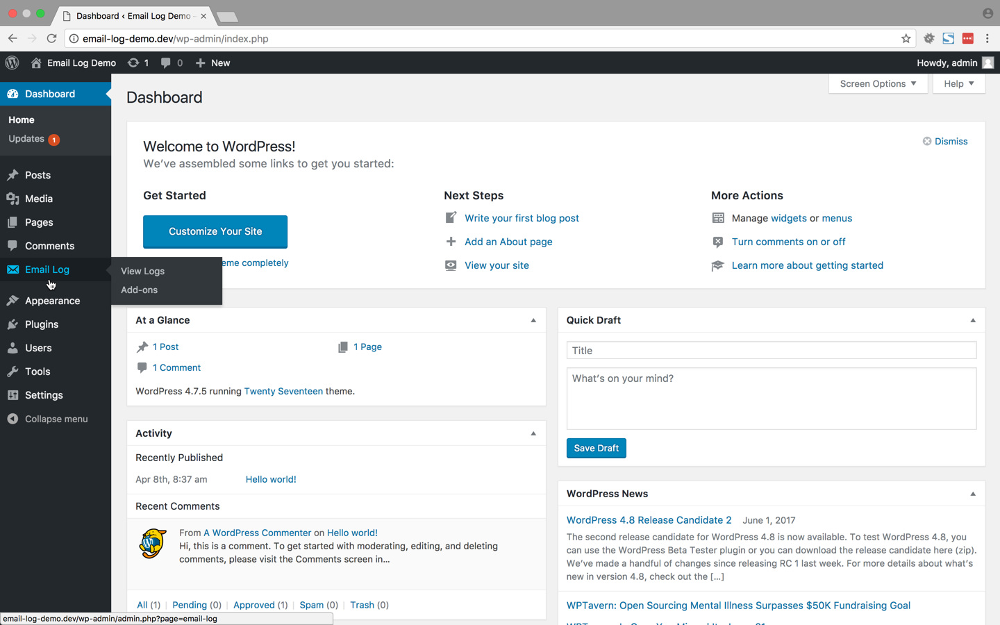
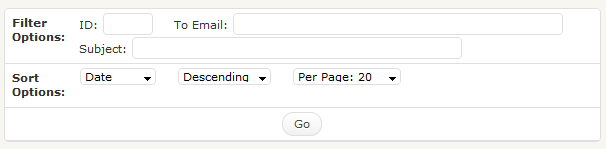
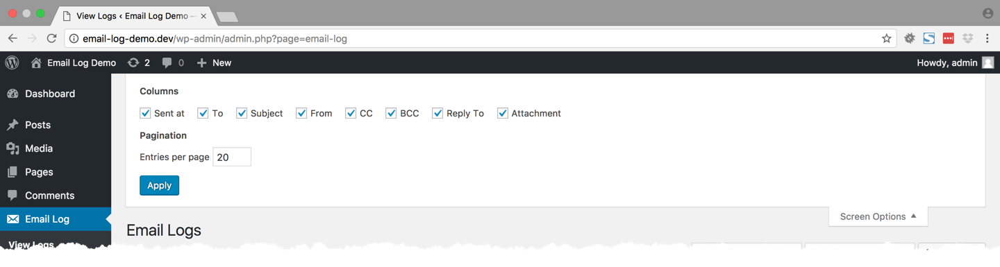
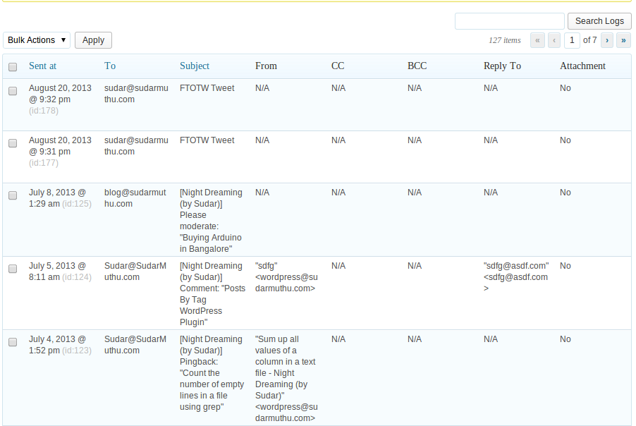
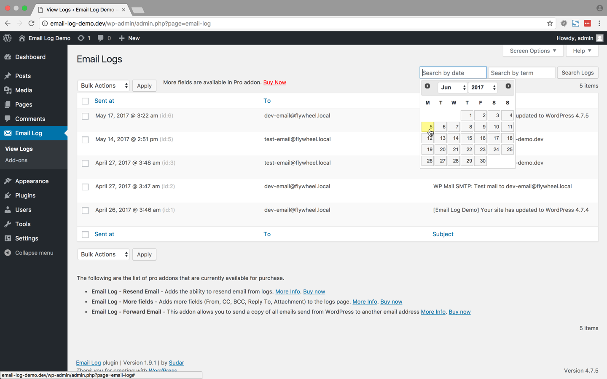

# Email Log #
**Contributors:** sudar  
**Tags:** email, log, multisite  
**Requires at least:** 3.3  
**Tested up to:** 4.0  
**Stable tag:** 1.7.5  

Logs every email sent through WordPress. Works with WordPress Multisite as well

## Description ##

Logs every email sent through WordPress and provides a UI where you can view them.

### Viewing logged emails

The logged emails will be stored in a separate table and can be viewed from the admin interface. While viewing the logs, the emails can be filtered or sorted based on the date, email, subject etc.

### Deleting logged emails

In the admin interface, all the logged emails can be delete in bulk or can also be selectively deleted based on date, email and subject.

### Forward email (Pro addon)

You can [buy the Forward email pro addon](http://sudarmuthu.com/wordpress/email-log/pro-addons#forward-email-addon), which allows you to send a copy of all the emails send from WordPress, to another email address. The addon allows you to choose whether you want to forward through to, cc or bcc fields. This can be extremely useful when you want to debug by analyzing the emails that are sent from WordPress. The cost of the addon is $15 and you can buy it through [paypal](http://sudarmuthu.com/out/buy-email-log-forward-email-addon).

### More Fields (Pro addon)

You can [buy the More Fields pro addon](http://sudarmuthu.com/wordpress/email-log/pro-addons#more-fields-addon), which shows additional fields in the email log page. The following are the additional fields that are added by this addon.

- From
- CC
- BCC
- Reply To
- Attachment

The cost of the addon is $15 and you can buy it through [paypal](http://sudarmuthu.com/out/buy-email-log-more-fields-addon).

### Cleaning up db on uninstall

As [recommended by Ozh][1], the Plugin has an uninstall hook which will clean up the database when the Plugin is uninstalled.

 [1]: http://sudarmuthu.com/blog/2009/10/07/lessons-from-wordpress-plugin-competition.html

### Development

The development of the Plugin happens over at [github](http://github.com/sudar/email-log). If you want to contribute to the Plugin, [fork the project at github](http://github.com/sudar/email-log) and send me a pull request.

If you are not familiar with either git or Github then refer to this [guide to see how fork and send pull request](http://sudarmuthu.com/blog/contributing-to-project-hosted-in-github).

If you are looking for ideas, then you can start with one of the following TODO items :)

### TODO for Future releases

The following are the features that I am thinking of adding to the Plugin, when I get some free time. If you have any feature request or want to increase the priority of a particular feature, then let me know.

- Add option to automatically delete the logs periodically
- Add the ability to resend the emails
- <strike>Make it MU compatible</strike>. Done in v1.7

### Support

- If you have found a bug/issue or have a feature request, then post them in [github issues](https://github.com/sudar/email-log/issues)
- If you have a question about usage or need help to troubleshoot, then post in WordPress forums or leave a comment in [Plugins's home page][1]
- If you like the Plugin, then kindly leave a review/feedback at [WordPress repo page][7].
- If you find this Plugin useful or and wanted to say thank you, then there are ways to [make me happy](http://sudarmuthu.com/if-you-wanna-thank-me) :) and I would really appreciate if you can do one of those.
- If anything else, then contact me in [twitter][2].

### Stay updated

I would be posting updates about this Plugin in my [blog][3] and in [Twitter][2]. If you want to be informed when new version of this Plugin is released, then you can either subscribe to this [blog's RSS feed][4] or [follow me in Twitter][2].

You can also checkout some of the [other Plugins that I have released][5].

 [1]: http://sudarmuthu.com/wordpress/email-log
 [2]: http://twitter.com/sudarmuthu
 [3]: http://sudarmuthu.com/blog
 [4]: http://sudarmuthu.com/feed
 [5]: http://sudarmuthu.com/wordpress
 [7]: http://wordpress.org/extend/plugins/email-log

## Translation ##

The Plugin currently has translations for the following languages.

*   German (Thanks Frank)
*   Lithuanian (Thanks  Vincent G)
*   Dutch (Thanks Zjan Preijde)

The pot file is available with the Plugin. If you are willing to do translation for the Plugin, use the pot file to create the .po files for your language and let me know. I will add it to the Plugin after giving credit to you.

## Installation ##

### Normal WordPress installations

Extract the zip file and just drop the contents in the wp-content/plugins/ directory of your WordPress installation and then activate the Plugin from Plugins page.

## Frequently Asked Questions ##

### The content of the email is not getting logged when I am using wpmandrill plugin

wpmandrill plugin has a bug that prevents this plugin from logging the content of the email. More details about the bug is available at http://wordpress.org/support/topic/mandrill-is-changing-the-names-of-args-in-the-filter?replies=1. I have asked the author of the plugin to fix it and it might get fixed it the next release. Meanwhile, I have added a hack to handle this condition in v1.7.3 of my plugin. So if the content is not getting logged, then upgrade to v1.7.3.

## Screenshots ##

The above screenshot shows how the logged emails will be displayed by the Plugin

This screenshot shows how you can configure the email display screen. You can choose the fields and the number of emails per page

This screenshot shows the additional fields that will be added by the [more fields](http://sudarmuthu.com/wordpress/email-log/pro-addons#more-fields-addon) addon

The above screenshot shows how the logged emails will be displayed by the Plugin after you install the [more fields](http://sudarmuthu.com/wordpress/email-log/pro-addons#more-fields-addon) addon

This screenshot shows the settings page of [forward email](http://sudarmuthu.com/wordpress/email-log/pro-addons#forward-email-addon) addon

## Readme Generator ##

This Readme file was generated using <a href = 'http://sudarmuthu.com/wordpress/wp-readme'>wp-readme</a>, which generates readme files for WordPress Plugins.
